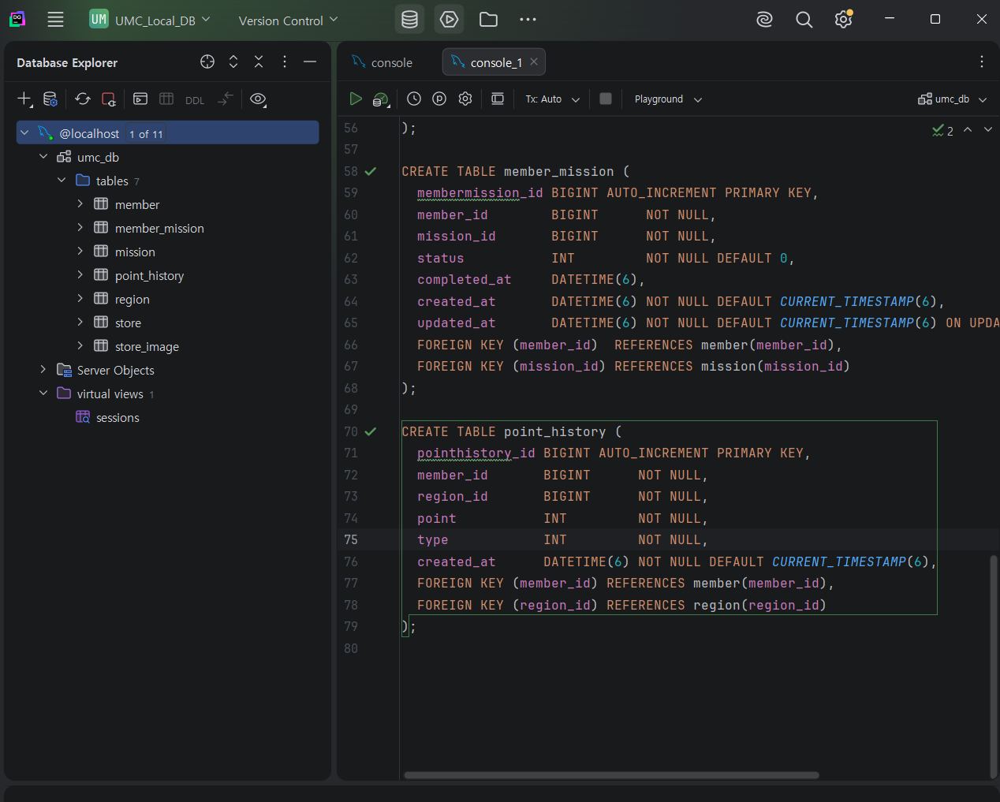
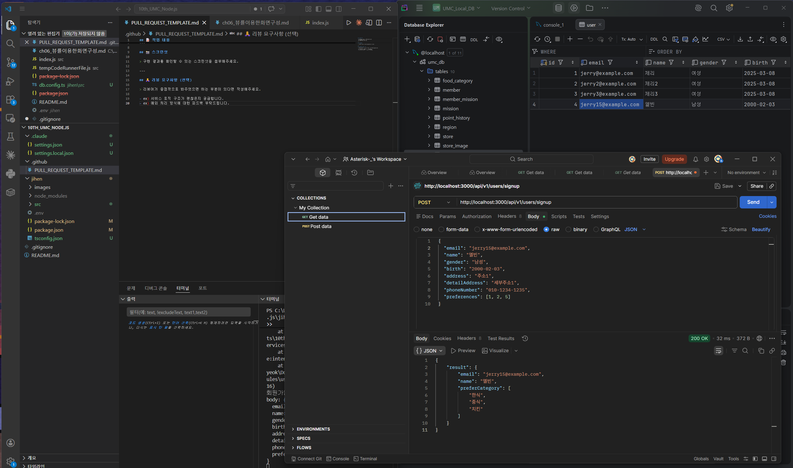
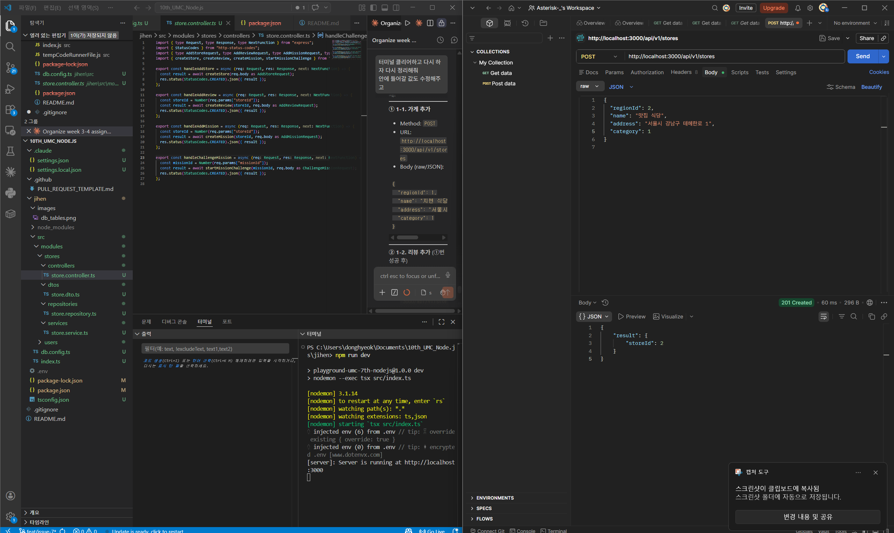
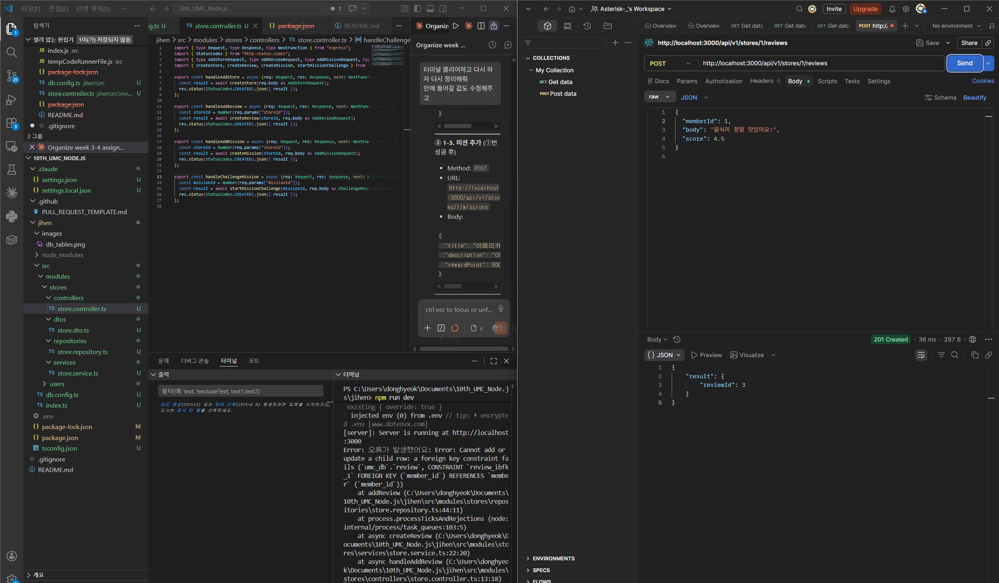
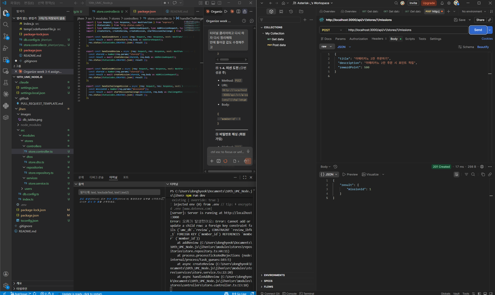
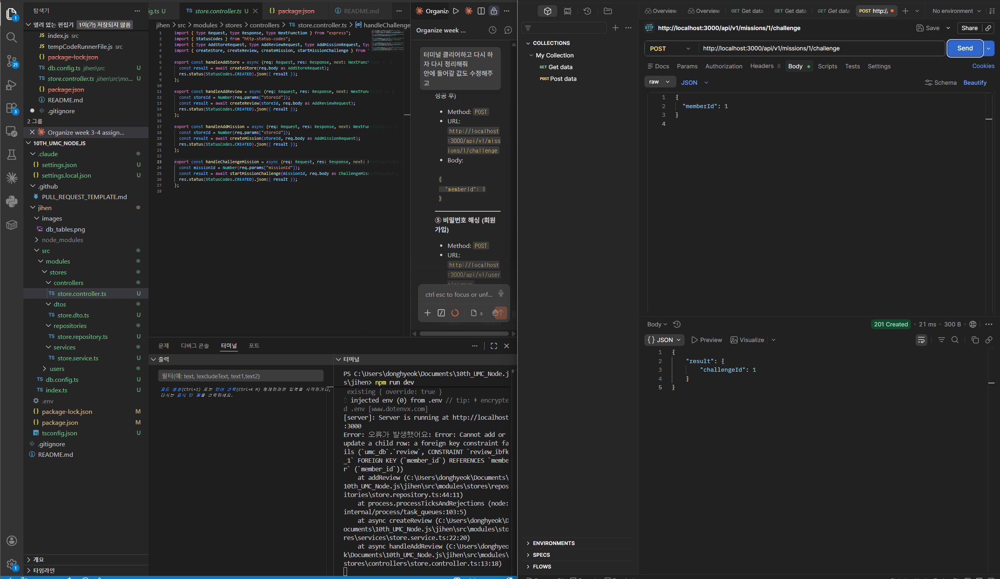
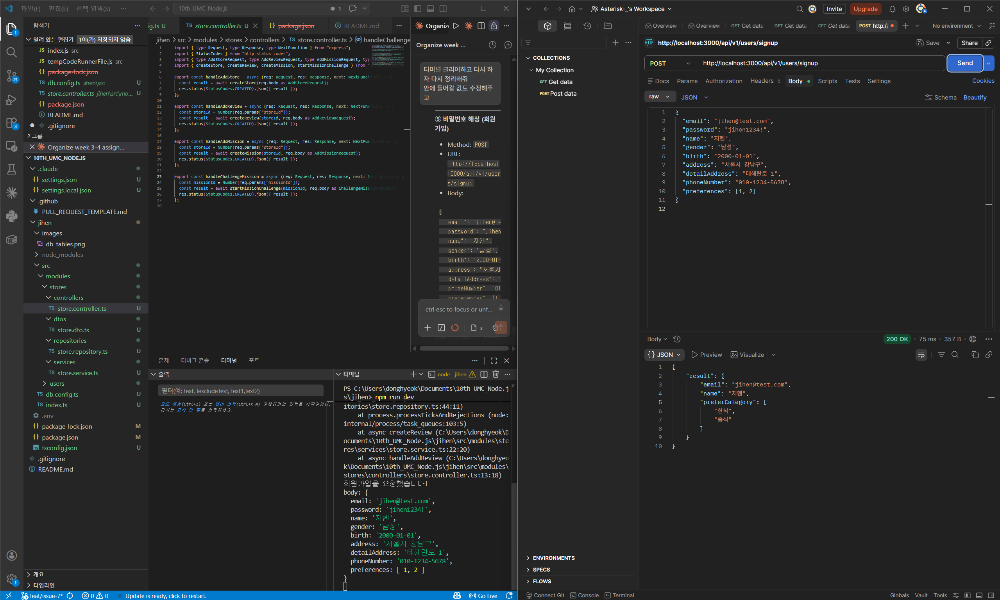

# jihen - UMC 10th Node.js

## Chapter 04 - API 및 프로젝트 설정 기초

---

## Chapter 05 - TypeScript & 모듈형 API 구현

### 실습

#### Postman 설치 및 API 개발

---

### 미션

#### 1-1. 특정 지역에 가게 추가하기 API

`POST /api/v1/stores`

---

#### 1-2. 가게에 리뷰 추가하기 API

`POST /api/v1/stores/:storeId/reviews`

- 리뷰를 추가하려는 가게가 존재하는지 검증

---

#### 1-3. 가게에 미션 추가하기 API

`POST /api/v1/stores/:storeId/missions`

---

#### 1-4. 가게의 미션을 도전 중인 미션에 추가 API

`POST /api/v1/missions/:missionId/challenge`

- 이미 도전 중인 미션인지 검증

---

#### 회원가입 API - 비밀번호 해싱

`POST /api/v1/users/signup`

- bcrypt를 사용한 비밀번호 해싱 적용

---

### Controller → Service → Repository → DB 요청 흐름

1. 사용자가 `POST /api/v1/users/signup` 요청을 보냄
2. **Controller** (`handleUserSignUp`) 가 `req.body` 를 받아 DTO (`bodyToUser`) 로 변환
3. **Service** (`userSignUp`) 에 전달 → bcrypt로 비밀번호 해싱 → 이메일 중복 검사 등 비즈니스 로직 처리
4. **Repository** (`addUser`) 를 통해 SQL 쿼리 실행
5. **DB** `user` 테이블에 데이터 INSERT
6. 결과를 역순으로 반환 → Controller가 200 응답
